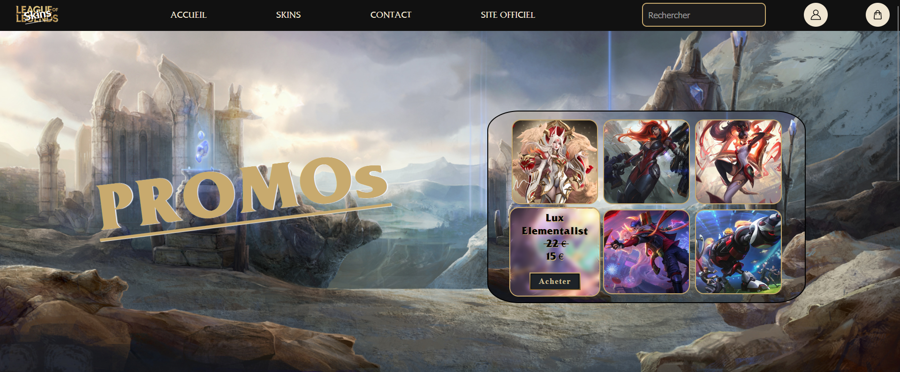

# Site vitrine - Vente de skins League of Legends

## Description
Ce projet est un site vitrine réalisé dans le cadre du BUT Informatique.  
Il s'agit d’un site de présentation dédié à la vente de skins *League of Legends*.

Le site est composé de deux pages :
- Une page d’accueil
- Une page de connexion (login)

## Technologies utilisées
- HTML
- CSS

## Lancement du projet
Ce projet nécessite un serveur web pour fonctionner correctement.

### Méthode recommandée :
1. Ouvrir le projet avec Visual Studio Code
2. Installer l’extension **Live Server**
3. Faire un clic droit sur le fichier `index.html`
4. Cliquer sur **"Open with Live Server"**

Le site s’ouvrira automatiquement dans votre navigateur.

## Équipe
- Bastian COCHARD  
- Gaetan FERREIRA
